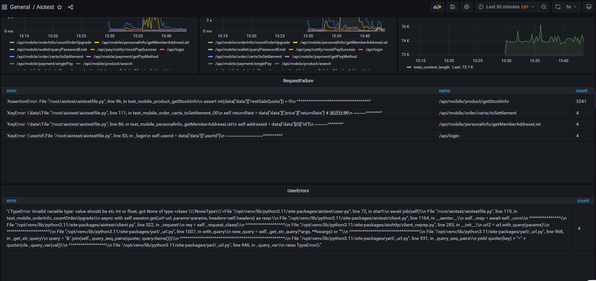

## Your first test
A Aiotest test is essentially just a Python program making requests to the system you want to test.  This makes it very flexible and particularly good at implementing complex user flows.  But it can do simple tests as well, so let’s start with that:
```python
from aiotest import AsyncHttpUser, LoadUserShape, logger

class TestUser(AsyncHttpUser):
    host = "https://uat.taobao.com"
    token = None

    async def on_start(self):
        url = "/login"
        data = {"username": "admin", "password": "123456"}
        async with self.session.post(url=url, data=data) as resp:
            data = await resp.json()
            self.token = data["token"]

    async def test_search(self):
        url = "/search"
        hearders = {"Authorization": self.token}
        data = {"keyword": "F22"}
        async with self.session.post(url=url, hearders=hearders, json=data) as resp:
            data = await resp.json()      

    async def test_personal_info(self):
        url = "/personalInfo"
        async with self.session.get(url=url, hearders=hearders) as resp:
            data = await resp.json()

```
This user will make HTTP requests to `/search`, and then `/personalInfo`, again and again. For a full explanation and a more realistic example see Writing a [aiotestfile](writing-a-aiotestfile.md).

Change `/search` and `/personalInfo` to some actual paths on the web site/service you want to test, put the code in a file named `aiotestfile.py` in your current directory and then run `aiotest`:
```console
$ aiotst -f aiotestfile.py
2023-09-26 11:19:35.337 | INFO     | aiotest.runners:start_users:130 - starting 1 users at the rate 1 users/s, (0 users already running)...
2023-09-26 11:19:36.313 | INFO     | aiotest.runners:start_users:147 - All users started: TestVipUser:1
2023-09-26 11:19:39.739 | INFO     | aiotest.runners:stop_users:167 - Stopping 1 users immediately
```
### Aiotest’s prometheus interface
open http://localhost:8089
```console
# HELP python_gc_objects_collected_total Objects collected during gc
# TYPE python_gc_objects_collected_total counter
python_gc_objects_collected_total{generation="0"} 1064.0
python_gc_objects_collected_total{generation="1"} 542.0
python_gc_objects_collected_total{generation="2"} 0.0
# HELP python_gc_objects_uncollectable_total Uncollectable objects found during GC
# TYPE python_gc_objects_uncollectable_total counter
python_gc_objects_uncollectable_total{generation="0"} 0.0
python_gc_objects_uncollectable_total{generation="1"} 0.0
python_gc_objects_uncollectable_total{generation="2"} 0.0
# HELP python_gc_collections_total Number of times this generation was collected
# TYPE python_gc_collections_total counter
python_gc_collections_total{generation="0"} 102.0
python_gc_collections_total{generation="1"} 9.0
python_gc_collections_total{generation="2"} 0.0
# HELP python_info Python platform information
# TYPE python_info gauge
python_info{implementation="CPython",major="3",minor="11",patchlevel="3",version="3.11.3"} 1.0
# HELP aiotest_workers_user_count aiotest workers user count
# TYPE aiotest_workers_user_count gauge
aiotest_workers_user_count{node="local"} 1.0
# HELP aiotest_workers_cpu_usage aiotest workers cpu usage
# TYPE aiotest_workers_cpu_usage gauge
aiotest_workers_cpu_usage{node="Local"} 0.3
# HELP aiotest_response_content_length aiotest response content length
# TYPE aiotest_response_content_length gauge
aiotest_response_content_length{code="200",method="POST",name="/login"} 1115.0
aiotest_response_content_length{code="200",method="POST",name="/search"} 7836.0
aiotest_response_content_length{code="200",method="GET",name="/personalInfo"} 401.0
# HELP aiotest_response_failure_total aiotest response failure
# TYPE aiotest_response_failure_total counter
# HELP aiotest_user_error_total aiotest user error
# TYPE aiotest_user_error_total counter
# HELP aiotest_response_times aiotest response times
# TYPE aiotest_response_times histogram
aiotest_response_times_bucket{code="200",le="50.0",method="POST",name="/login"} 0.0
aiotest_response_times_bucket{code="200",le="100.0",method="POST",name="/login"} 0.0
aiotest_response_times_bucket{code="200",le="200.0",method="POST",name="/login"} 0.0
aiotest_response_times_bucket{code="200",le="300.0",method="POST",name="/login"} 1.0
aiotest_response_times_bucket{code="200",le="400.0",method="POST",name="/login"} 1.0
aiotest_response_times_bucket{code="200",le="500.0",method="POST",name="/login"} 1.0
aiotest_response_times_bucket{code="200",le="600.0",method="POST",name="/login"} 1.0
aiotest_response_times_bucket{code="200",le="700.0",method="POST",name="/login"} 1.0
aiotest_response_times_bucket{code="200",le="800.0",method="POST",name="/login"} 1.0
aiotest_response_times_bucket{code="200",le="900.0",method="POST",name="/login"} 1.0
aiotest_response_times_bucket{code="200",le="1000.0",method="POST",name="/login"} 1.0
aiotest_response_times_bucket{code="200",le="2000.0",method="POST",name="/login"} 1.0
aiotest_response_times_bucket{code="200",le="5000.0",method="POST",name="/login"} 1.0
aiotest_response_times_bucket{code="200",le="8000.0",method="POST",name="/login"} 1.0
aiotest_response_times_bucket{code="200",le="+Inf",method="POST",name="/login"} 1.0
aiotest_response_times_count{code="200",method="POST",name="/login"} 1.0
aiotest_response_times_sum{code="200",method="POST",name="/login"} 277.0
aiotest_response_times_bucket{code="200",le="50.0",method="POST",name="/search"} 2.0
aiotest_response_times_bucket{code="200",le="100.0",method="POST",name="/search"} 2.0
aiotest_response_times_bucket{code="200",le="200.0",method="POST",name="/search"} 2.0
aiotest_response_times_bucket{code="200",le="300.0",method="POST",name="/search"} 2.0
aiotest_response_times_bucket{code="200",le="400.0",method="POST",name="/search"} 2.0
aiotest_response_times_bucket{code="200",le="500.0",method="POST",name="/search"} 2.0
aiotest_response_times_bucket{code="200",le="600.0",method="POST",name="/search"} 2.0
aiotest_response_times_bucket{code="200",le="700.0",method="POST",name="/search"} 2.0
aiotest_response_times_bucket{code="200",le="800.0",method="POST",name="/search"} 2.0
aiotest_response_times_bucket{code="200",le="900.0",method="POST",name="/search"} 2.0
aiotest_response_times_bucket{code="200",le="1000.0",method="POST",name="/search"} 2.0
aiotest_response_times_bucket{code="200",le="2000.0",method="POST",name="/search"} 2.0
aiotest_response_times_bucket{code="200",le="5000.0",method="POST",name="/search"} 2.0
aiotest_response_times_bucket{code="200",le="8000.0",method="POST",name="/search"} 2.0
aiotest_response_times_bucket{code="200",le="+Inf",method="POST",name="/search"} 2.0
aiotest_response_times_count{code="200",method="POST",name="/search"} 2.0
aiotest_response_times_sum{code="200",method="POST",name="/search"} 79.0
aiotest_response_times_bucket{code="200",le="50.0",method="GET",name="/personalInfo"} 2.0
aiotest_response_times_bucket{code="200",le="100.0",method="GET",name="/personalInfo"} 2.0
aiotest_response_times_bucket{code="200",le="200.0",method="GET",name="/personalInfo"} 2.0
aiotest_response_times_bucket{code="200",le="300.0",method="GET",name="/personalInfo"} 2.0
aiotest_response_times_bucket{code="200",le="400.0",method="GET",name="/personalInfo"} 2.0
aiotest_response_times_bucket{code="200",le="500.0",method="GET",name="/personalInfo"} 2.0
aiotest_response_times_bucket{code="200",le="600.0",method="GET",name="/personalInfo"} 2.0
aiotest_response_times_bucket{code="200",le="700.0",method="GET",name="/personalInfo"} 2.0
aiotest_response_times_bucket{code="200",le="800.0",method="GET",name="/personalInfo"} 2.0
aiotest_response_times_bucket{code="200",le="900.0",method="GET",name="/personalInfo"} 2.0
aiotest_response_times_bucket{code="200",le="1000.0",method="GET",name="/personalInfo"} 2.0
aiotest_response_times_bucket{code="200",le="2000.0",method="GET",name="/personalInfo"} 2.0
aiotest_response_times_bucket{code="200",le="5000.0",method="GET",name="/personalInfo"} 2.0
aiotest_response_times_bucket{code="200",le="8000.0",method="GET",name="/personalInfo"} 2.0
aiotest_response_times_bucket{code="200",le="+Inf",method="GET",name="/personalInfo"} 2.0
aiotest_response_times_count{code="200",method="GET",name="/personalInfo"} 2.0
aiotest_response_times_sum{code="200",method="GET",name="/personalInfo"} 63.0
```
### Aiotest’s grafana interface
open http://localhost:3000



### More options
To run Aiotest distributed across multiple Python processes or machines, you start a single Aiotest master process
with the `--master` command line parameter, and then any number of Aiotest worker processes using the `--worker`
command line parameter. See [Distributed load test](running-distributed.md) for more info.

To see all available options type: `aiotest --help`.

### Next steps
Now, let's have a more in-depth look at aiotestfiles and what they can do: [Writing a aiotestfile](writing-a-aiotestfile.md).